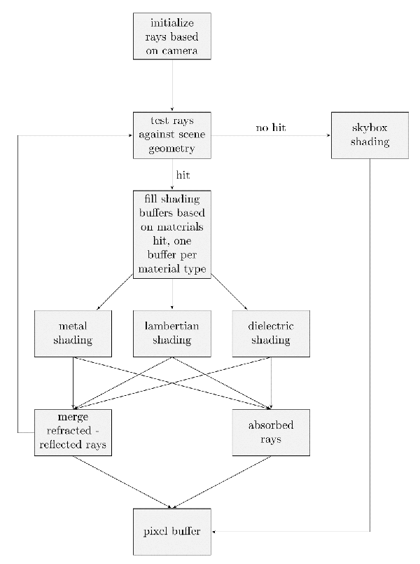

# CppPathTracer

*Disclaimer: This is a work in progress*

## Introduction

This is a toy path tracer initially based on Peter Shirley's ebook [Ray Tracing in One Weekend](https://www.amazon.ca/Ray-Tracing-Weekend-Minibooks-Book-ebook/dp/B01B5AODD8). This is an educational project meant to give me an opportunity to learn about path tracing and modern C++, and is nowhere close to being a production renderer.

While the lighting model remains the same as in the book, the code is structured differently. We make heavy use of buffers and do not use explicit recursion.

The goal here is to lay the bases of a (reasonably) performant and extendable path tracer.

## Usage

#### Running The App

The app is meant to be used as a command line tool, rendering an image based on the argument provided, namely:
- ```-x``` output image width
- ```-y``` output image width
- ```-a``` antialiasing (number of rays per pixel)
- ```-d``` maximal depth (max number of times a ray may be reflected / refracted)
- ```-f``` scene description file

#### Scene Description File

The scene is described in an external text file. It contains geometric and shading data for each mesh. A ```Mesh``` has a **geometric primitive type** and a **material type**. It holds two buffers, one for geometric data, the other for shading data. Obviously, the number of elements in these buffers have to match.

The scene file is structured in the following way:
- mesh header: ```mesh [primitive type] [material type]``` ex: ```mesh sphere lambertian```.
- followed by data for every mesh element: ```[primitive data] [material data]```, ex: ```0 -100.5 -1 100 0 1 0``` (sphere centered at (0 -100.5 -1) of radius 100, material albedo is (0, 1, 0)).

## Current Architecture

The central piece is the ```Renderer```, it gets passed a buffer of rays and an immutable reference to the world. It will then be able to iteratively propagate rays in the world and compute ray attenuation (shading).

We use distinct structs for geometric primitives (spheres, ...) and materials (lambertian, metal, ...). We then provide functors operating on buffers of those structs. For example, ```SphereCollider``` is responsible for detecting hits between a ray and a collection of spheres, ```MetalShader``` is responsible for updating rays based on their hit with metal objects.

Instead of using a straightforward explicit recursion for ray propagation, we use ping pong ray buffers. It lets us batch hit detection and shading operations, and will lead in better performance as the tool gets more complete and scenes grow in complexity.

Data flow is described in the graph below:


## Next In Line Features
- Support more geometric primitives, such as triangles.
- Parallel rendering: distribute rays among multiple renderers each running on its own thread.
- Acceleration structure for rays / world hit detection, such as Bounding Volume Hierarchy.
